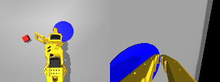
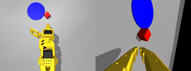
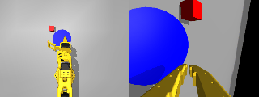
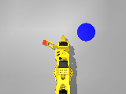

# SO-101 pick-and-place with LeRobot: sim first, then hardware

Imitation learning on the [SO-101](https://github.com/TheRobotStudio/SO-ARM100) low-cost arm using
[LeRobot](https://github.com/huggingface/lerobot) 0.6 and ACT. Phase 1 (this repo, today) runs the
whole pipeline in MuJoCo via [so101-nexus](https://github.com/johnsutor/so101-nexus) with a
scripted IK expert as the demonstrator. Phase 2 swaps the demonstrator for a physical leader arm;
dataset keys and units are already those of LeRobot's `so101_follower`, so the training and
evaluation code does not change.

| | |
|---|---|
| Task | pick up the 25 mm red cube, place it on the 5 cm-radius blue disc (success: cube centre within 4 cm of disc centre) |
| Robot | SO-101, MuJoCo Menagerie `robotstudio_so101` model, position-controlled STS3215 actuators |
| Observations | 6 joint positions (deg, gripper 0-100) + wrist and overhead RGB 320x240 |
| Actions | absolute joint targets, same units |
| Data | 600 expert episodes, 92,940 frames at 50 Hz, LeRobot v3 format (best run) |
| Policy | ACT (52M params), trained on an Apple M5 via MPS |

## Results (sim, 2026-09-22)

Success = cube released within 4 cm of the centre of the 5 cm-radius disc ("on the blue circle"), cube static, gripper open. Evaluated on cube/disc layouts never seen in training.

| Run | Data | Steps | Success (unseen layouts) |
|---|---|---|---|
| ACT, 640x480, 50 demos, random wrist cam | 7,790 frames | 20k (Mac) / 5k x bs32 (A100) | 1-2 / 20 |
| ACT, 320x240, 200 demos, random wrist cam | 31,161 frames | 10k-30k | 3-6 / 20 |
| ACT, 320x240, 300 demos, fixed wrist cam (v3) | 46,337 frames | 40k | 21 / 50 = 42 % (25/50 grasps) |
| v3, continued | same | 50k | 33 / 50 = 66 % |
| v3, continued | same | 60k | 34 / 50 = 68 % (38/50 grasps) |
| v3, continued | same | 70k / 80k | 27 / 50 = 54 % · 29 / 50 = 58 % (plateau) |
| ACT, 320x240, 600 demos, tighter overhead crop (v6), warm-started from v3-60k | 92,940 frames | 10k | 36 / 50 = 72 % |
| **v6, continued** | same | **20k** | **44 / 50 = 88 %** · 46 / 50 = 92 % on a second seed set · **90 / 100 pooled = 90 %** |

What moved the needle, in order: **warm-starting a new run from the previous best checkpoint** (v6 reached 72 % after 10k steps, where v3 needed 60k to reach 68 %, and 88 % by 20k); doubling the demonstrations to 600; training long enough (v3 went 42 % to 68 % between 40k and 60k steps on data alone); halving image resolution so the same Mac could afford 3x more steps; fixing the simulated wrist camera (so101-nexus randomises its FOV/pitch/position every episode, which destroys the fine-alignment cue a rigidly mounted real camera gives); and tightening the overhead camera margin to 0.04 so the cube occupies more pixels. What did not: temporal ensembling, re-planning every 25 or 50 steps (both worse than executing the full 100-step chunk), a 35 mm cube (the scripted expert does not yaw-align the jaw, so its big-cube demos are inconsistent), and training v3 past 60k (54-58 % at 70k-80k).

Remaining failure mode is lateral precision at grasp: of the 6 failures in 50, 5 never close on the cube at all and 1 grasps without lifting. Every successful grasp becomes a successful placement, and failures are spread evenly over the 0.06-0.22 m spawn range, so this is vision precision rather than reach. Replaying recorded expert actions in the simulator succeeds 4/4, so the data path (units, timing, cameras) is verified end to end.

| v6 policy rollouts at 88 % (overhead + wrist) | |
|---|---|
|  |  |
|  (a failure from the earlier 42 % policy) |  (scripted expert) |


## Pipeline

```bash
uv venv --python 3.12 .venv && source .venv/bin/activate
uv pip install 'lerobot[core_scripts,training,feetech]' so101-nexus
export MUJOCO_GL=glfw   # macOS offscreen rendering

python collect_sim.py --dry-run --episodes 20        # expert only, prints success rate
python collect_sim.py --episodes 600 --seed 11 --spawn-min 0.04 --spawn-max 0.17 \
    --img-w 320 --img-h 240 --overhead-margin 0.04 --root data/so101_sim_pick_place_v6

# from scratch:
DATASET_ROOT=data/so101_sim_pick_place_v6 RUN=act_sim_v6 SAVE_FREQ=10000 ./train.sh 60000 mps
# or warm-start from the previous best checkpoint - 88 % by 20k steps instead of 68 % by 60k
# (--policy.path replaces --policy.type, so call lerobot-train directly):
lerobot-train --policy.path=outputs/train/act_sim_v3/checkpoints/060000/pretrained_model \
    --policy.device=mps --policy.push_to_hub=false \
    --dataset.repo_id=aviadarn/so101_sim_pick_place_v6 \
    --dataset.root=data/so101_sim_pick_place_v6 \
    --output_dir=outputs/train/act_sim_v6 --job_name=act_sim_v6 \
    --steps=60000 --batch_size=8 --save_freq=10000 --num_workers=2 --wandb.enable=false

python eval_sim.py --policy outputs/train/act_sim_v6/checkpoints/020000/pretrained_model \
    --episodes 50 --seed 9100 --goal-thresh 0.04 --overhead-margin 0.04 --gif-dir assets/rollouts
```

## Scripted expert

`collect_sim.py` drives the arm through a waypoint FSM (hover, descend, close, lift, carry, lower,
open, retreat) in tool space and resolves each step with the env's damped-least-squares IK, so the
recorded action stream is smooth absolute joint targets, exactly what a leader arm produces. Three
details that took the expert from 59 % to 97-100 % success:

- **Jaw opening.** At 1.2 rad the moving jaw hit the cube top on descent and the arm stalled.
  1.5 rad clears it.
- **Grasp-offset compensation.** The cube rarely sits exactly at the TCP after the jaw closes.
  After the lift the expert measures the cube-to-TCP offset and shifts the place waypoints by it,
  so the cube lands on the disc instead of the tool.
- **IK orientation weight.** so101-nexus defaults to 0.01 (orientation nearly ignored). 0.05 keeps
  the tool vertical and converged fastest across previously failing seeds.

Workspace: spawn radius 0.04-0.17 m around (0.15, 0), i.e. up to ~0.35 m from the base. Beyond
~0.33 m a top-down grasp is not kinematically reachable for this arm.

## Sim-to-real contract

Everything the policy sees is expressed in real-robot units through
`so101_nexus.lerobot_dataset.sim_qpos_to_dataset_row` (body joints in degrees, gripper as
percent of travel), the dataset declares `robot_type: so101_follower`, and the two camera keys
match a wrist + overhead webcam layout. On hardware, recording becomes
`lerobot-record --robot.type=so101_follower --teleop.type=so101_leader ...` and deployment
`lerobot-rollout --policy.path=...`; `train.sh` is unchanged.
