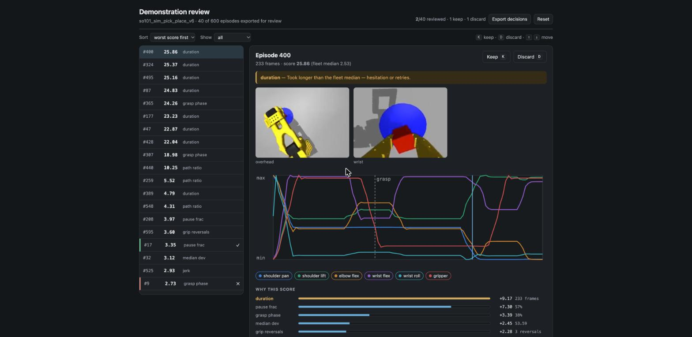

# Demonstration review UI

The reviewer-facing surface for `tools/score_demos.py`. The scorer ranks demonstrations and
names the signal it flagged each one on; this is where a person checks that judgement and
decides what to keep.

React 18 + TypeScript + Vite, no UI framework and no charting dependency — the trajectory
plot is hand-drawn SVG, which is about forty lines and saves ~300 kB.



## What it shows

- **Ranked list** — worst score first by default, sortable by score or episode order,
  filterable to undecided / flagged / clean.
- **Both camera clips**, scrubbable and kept in sync with each other.
- **Joint trajectories**, with a playhead driven by video time and a dashed marker at the
  frame where the gripper closes. Channels toggle individually.
- **Why this score** — each signal's weighted contribution next to its raw measurement,
  because "2.4σ above the fleet" means nothing without "233 frames".
- **Keep / discard**, entirely from the keyboard (`K`, `D`, `↑`/`↓`), persisted in
  localStorage so a half-finished pass survives a reload, and exportable as JSON.

## Run it

```bash
# 1. score a dataset and export a reviewable slice
python ../tools/score_demos.py  --root ../data/<dataset> --out ../results/curation/scores.json
python ../tools/export_review.py --root ../data/<dataset> \
    --scores ../results/curation/scores.json --out public --episodes 40

# 2. serve it
npm install
npm run dev        # or: npm run build && npx serve dist
```

`export_review.py` transcodes clips to H.264 because LeRobot writes AV1, which Safari and
older Chrome will not reliably play — a review tool that silently shows a blank video is
worse than none. It also exports a bounded slice (worst, best, and an even spread between)
so the whole thing stays small enough to open as a single page.
